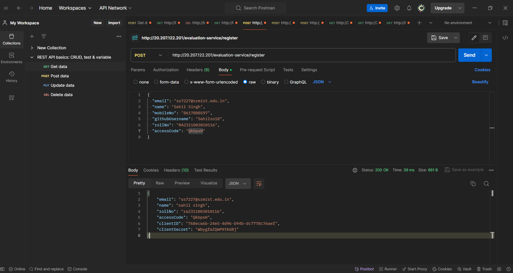
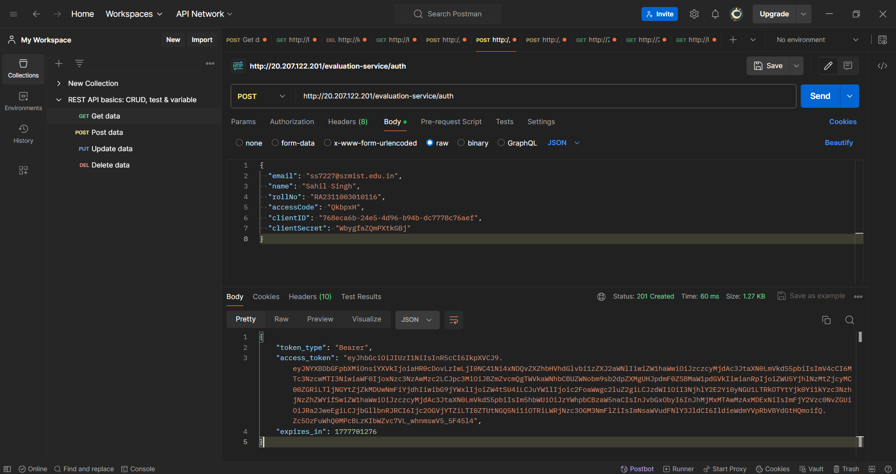
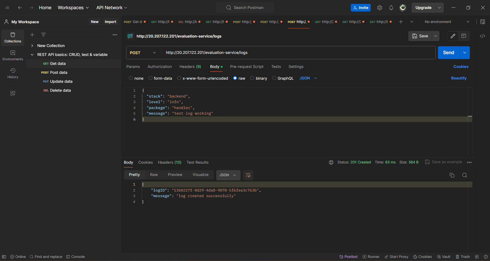
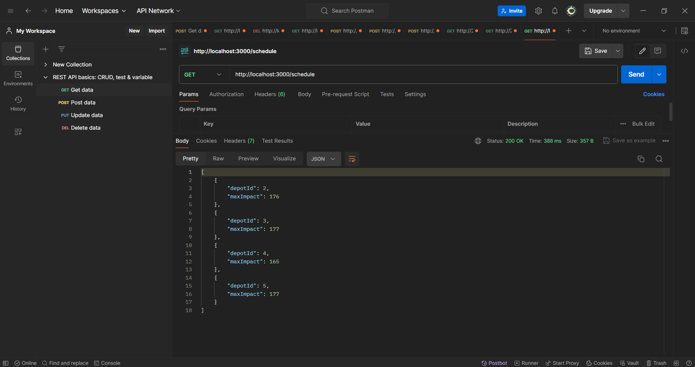

# RA2311003010116

# Vehicle Maintenance Scheduler

## Overview
This project implements a backend microservice to optimize vehicle maintenance scheduling using a 0/1 Knapsack approach.

## Features
- Fetches depot and vehicle data from external APIs
- Computes maximum impact within available mechanic hours
- Implements logging middleware for observability

## Tech Stack
- Node.js
- Express.js
- Axios

## Algorithm
Used Dynamic Programming (0/1 Knapsack) to maximize impact under time constraints.

## API

### GET /schedule
Returns optimal scheduling result:

[
	{ "depotId": 1, "maxImpact": 176 }
]

---

## 📸 Screenshots

### 🔹 Registration (Client ID Generated)

### 🔹 Authentication (Access Token)

### 🔹 Logging API Working

### 🔹 Final Schedule API Response

---

## Logging
Custom logging middleware integrated using provided logging API.

---

## Complexity
- Time Complexity: O(n * W)
- Space Complexity: O(W)
